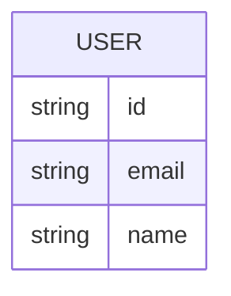

# Domain Model

The app has a single entity: the signed-in User, identified by the platform's identity provider. There is no other persisted or modeled data.

**User** — the person Thunder authenticates. The app reads only the identity Thunder provides; it stores nothing of its own.