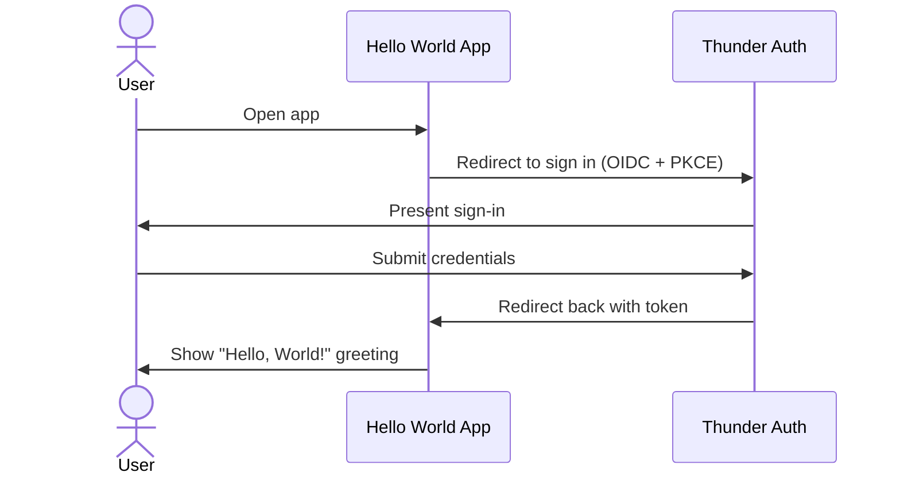

# Sign In and View Greeting

A User opens the app, is redirected through Thunder to sign in, and returns to see the "Hello, World!" greeting.

```mermaid
sequenceDiagram
    actor User
    participant hello-webapp as Hello World App
    participant thunder-auth as Thunder Auth

    User->>hello-webapp: Open app
    hello-webapp->>thunder-auth: Redirect to sign in (OIDC + PKCE)
    thunder-auth->>User: Present sign-in
    User->>thunder-auth: Submit credentials
    thunder-auth->>hello-webapp: Redirect back with token
    hello-webapp->>User: Show "Hello, World!" greeting
```

